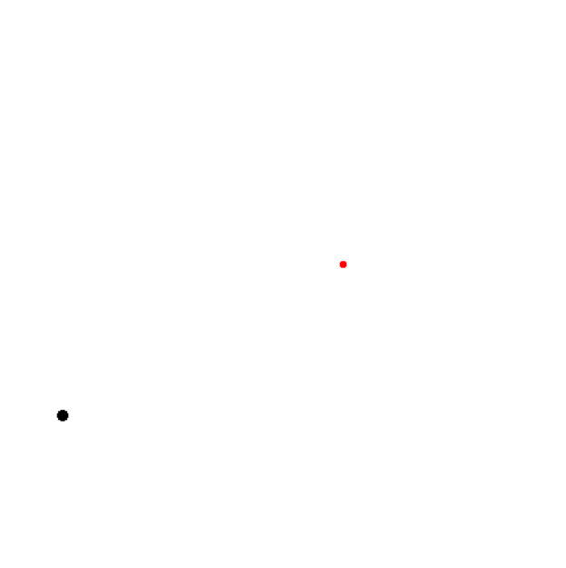

# GYM Curling

​		本环境是一个gym-like环境，你能轻松将其他以gym为实验环境的程序移植过来。


## 安装步骤

1. 安装Gym（已安装的请忽略）

```
pip install gym
```


2. 下载`__init__.py`和`curling.py`并将其放复制在`/gym/envs/classic_control`中，或者对于`__init__.py`也可以复制以下程序到原文件中：

```python
from gym.envs.classic_control.curling import CurlingEnv
```


3. 在`/gym/envs/__init__.py`中的合适地方添加以下程序：

```python
register(
    id='Curling-v0',
    entry_point='gym.envs.classic_control:CurlingEnv',
    max_episode_steps=3000,
    reward_threshold=100.0,
)
```


4. 测试：

```python
import gym


if __name__ == '__main__':
    env = gym.make('Curling-v0')

    env.reset()
    for episode in range(100):
        state = env.reset()
        target_points = env.target_points

        for t in range(3000 + 1):
            env.render()

            action = env.action_space.sample()

            state, reward, done, info = env.step(action)

            if t == 3000:
                done = True
            else:
                done = False

    env.close()

```

​		以下为渲染结果：

<center>
    
    <br>
    <div style="color:orange; border-bottom: 1px solid #d9d9d9;
    display: inline-block;
    color: #999;
    padding: 2px;">
      渲染示意图
  	</div>
</center>

## 环境介绍

​		冰壶的半径为1质量为1，在一个长宽均为100的球场内，在力的作用下移动至目标点，其中冰壶动力学的仿真间隔为0.01秒，动作可执行的间隔为0.1秒，为实现这一功能，本环境使用动作冷却用于控制动作执行的间隔，只有间隔为0时才能执行动作，这一时间间隔通过`info['cooldown']`给出。值得注意的是，本环境不会因为达成目标而提前截至，采用固定时长的episode，每一episode共3000步（仿真时间30秒，实际渲染用时约50秒）。

+ 状态(state)：坐标+速度（未归一化）；
+ 动作(action)：上下左右四个方向作用力；
+ 奖赏(reward)：与目标距离的相反数；
+ 信息(info)：提供的动作冷却表示上一次执行动作后，还有多久冷却结束，从9到0；
+ 动力学：收到空气阻力$0.005*v^2$，在碰撞时速度乘上回弹系数0.9，移动方向与边界成反射关系；
+ 初始化：冰壶和目标点在每个episode开始时被重置在场地上的任意一点，冰壶在两个方向上的速度则在[-10, 10]区间内随机取得。


`提示：由于动作间隔的存在，请不要每收到一个state都存一次。`